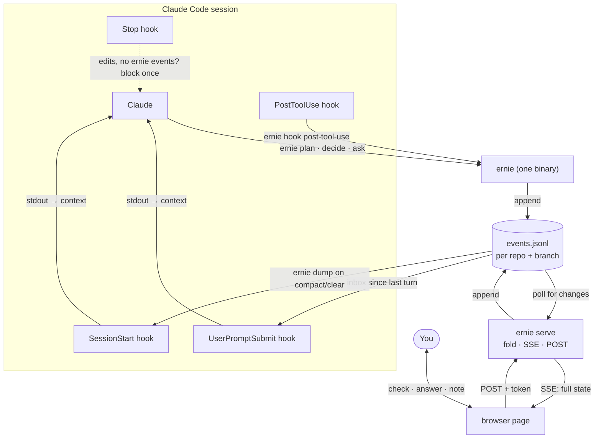
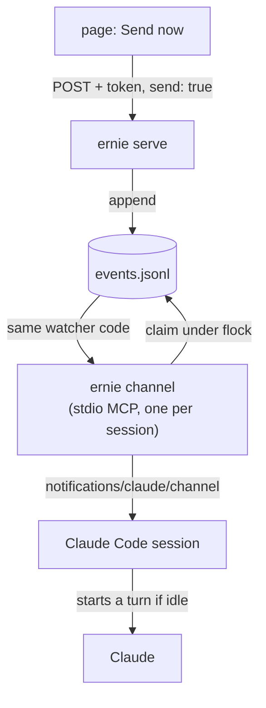

# Live Context UI — Plan

**Status:** ready to build, nothing built yet · **Updated:** 2026-10-03 (impl.md amendments A1–A20 folded in)

Files in this folder:
- `plan.md` — this doc (the build spec)
- `impl.md` — implementation plan: phase tasks, APIs, tests, done-when checks, spec amendments
- `proposal.html` — visual walkthrough of the design
- `mock.html` — standalone mock of the page; the visual target for phase 3

## Goal

A browser page next to the terminal that shows structured session state: plan, decisions, open questions, diagrams, facts and activity. You can answer and check things off in the page instead of the terminal. The same state gives Claude a compact summary to reload after compaction, so it doesn't have to reread the conversation.

## Decisions

| # | Decision | Why | Status |
|---|----------|-----|--------|
| D1 | Append-only JSONL event log is the source of truth | Claude never reads the file before writing; safe with several writers; history for free | decided |
| D2 | Go, one binary `ernie` (CLI + hook handlers + server) | Already installed (go1.26.1), ~4ms warm start, stdlib covers HTTP/SSE/JSON/embed/tests | decided 2026-10-02 |
| D3 | Fold events into state on the server; the page only renders | The fold logic lives once, in Go, and is tested once; no second copy in JS | decided 2026-10-02 |
| D4 | One log per repo + branch | Survives `/clear` and new sessions | decided |
| D5 | Source in its own repo at `~/things/myc/ernie`, built to `~/.local/bin`. Dotfiles keeps only the Claude-side pieces: hooks in `settings.json`, the `ernie` skill, the `mem`/`gtg`/`handoff` edits, and an `install.txt` entry | Own repo, own history. `~/things/myc` isn't carried by dotfiles sync (see the 2026-08-01 vim-herdr entry in `decisions.md`), so on a machine without ernie the dotfiles hooks must quietly do nothing | decided 2026-10-02 (was: dotfiles `ernie/`) |
| D6 | Tests with `go test` | You said yes | decided |
| D7 | Binary name `ernie` | Your pick; free on PATH, in Homebrew and in your zsh config | decided 2026-10-02 |
| D9 | `*um` mirrors each open ernie item into `queue.md` as its own line, with an `(ernie:…)` marker | Complete for `/mem`, `*mr` and other agents. Revisit (one summary line per branch for plan steps) if `queue.md` gets noisy | decided 2026-10-02 |
| D8 | v1 server started by hand: `ernie serve` in a herdr/tmux pane; `ernie open` only opens the browser | Visible logs, easy restart after rebuilds, no hidden background process. Move to launchd once stable | decided 2026-10-02 |
| D10 | Plan docs (`plan.md`, `impl.md`, `mock.html`, `proposal.html`) move to `~/things/myc/ernie/docs/` at task 1.1 | The spec lives with the code | decided 2026-10-02 |
| D11 | CLI built on `spf13/cobra`, the one exception to stdlib-only | Flags can go after positionals (`ernie decide "x" --why "y"`), nested subcommands, generated help, and zsh completion for free. Startup cost < 1ms | decided 2026-10-03 (impl A16) |
| D12 | Hooks are global (in `claude/.claude/settings.json`) and do nothing unless the branch has a log. Only `ernie init` creates a log, and Claude never runs it unless asked | One config for every repo; repos without a log are unaffected; the skill can't quietly turn ernie on everywhere | decided 2026-10-02 (impl A1, A2) |

## Q1: Go vs bash + jq vs Bun

Startup measured on this machine (50-run average):

| | Startup | Can run the server? | Fold logic + tests | New install? |
|---|---|---|---|---|
| bash + jq | ~3–7ms | no (needs a second language) | jq `reduce`; awkward to test | no |
| **Go** | **~4ms** (first run after a build ~20ms while macOS scans it) | yes, stdlib `net/http` | plain Go + `go test` | no |
| Bun | ~10–20ms (typical) | yes | shared JS with the page | **yes, not installed** |
| Node | 67ms | yes | shared JS | no (nvm) |

Go isn't heavy at runtime; it's the fastest option here that can do everything. The cost is at dev time: a build step, more verbose JSON code, and a binary you build on each machine (never commit it). bash + jq is just as fast for appending, but the server and the fold would still need another language, so you'd end up maintaining two. Bun's main advantage, sharing the fold with the browser, goes away once the server does the folding (D3).

## Architecture



## Storage

- **Path:** `~/.local/state/ernie/<repo-slug>/<branch>.jsonl` (`$ERNIE_HOME`, then `$XDG_STATE_HOME/ernie`, override the default). Kept out of every repo so work repos don't need gitignore changes, and never put in git.
  - Repo comes from `git rev-parse --git-common-dir` on the hook's `cwd`, so all worktrees of a repo share one folder. Their logs stay apart by branch, since git won't check out one branch in two worktrees.
  - The slug is the repo's basename (`dotfiles`). It becomes `dotfiles-3f2a1c` only if a different repo already owns that name; a `.root` file in each slug folder records the owner.
  - Branch comes from reading `<git-dir>/HEAD`. A detached HEAD during a rebase reads `rebase-merge/head-name` or `rebase-apply/head-name`; otherwise it uses the short SHA.
  - `%` and `/` in branch file names are escaped (`%25`, `%2F`). URLs and markers use the raw branch.
  - Outside a git repo, use a hash of the cwd.
- **On / off:** a branch is on only when its log exists. `ernie init` creates it (`O_CREATE|O_EXCL`). Everything else opens without `O_CREATE`, so a missing log means "do nothing", with no stat-then-open race. `ernie off` writes a `<branch>.off` marker that makes hooks and CLI writes do nothing; `ernie init` removes it.
- **Permissions:** log files `0600`, folders `0700`. `cmd run` events can hold command lines.
- **Writes:** an exclusive `flock` around read → change → append, all new lines in one `write`. The next-id lookup + append, the inbox read + turn mark, and the Stop check + `stop remind` each happen under one lock, so parallel writers (e.g. subagents) never reuse an id or lose an inbox event.
- **IDs:** the CLI folds the log to find the next id (`p4`, `d3`, `q2`) and prints it. Ids are never reused, even for dropped items. Disk reads are cheap; what matters is that Claude never spends tokens reading the file.

### Event envelope

```json
{"ts":"2026-10-02T14:03:11.042Z","by":"claude","t":"plan","op":"set","id":"p3","status":"done"}
```

| Field | Values |
|---|---|
| `ts` | RFC 3339 UTC, millisecond precision |
| `by` | `claude` · `hook` · `user` |
| `t` | component type (fixed set below) |
| `op` | operation for that type |
| `id` | stable per item |
| …rest | the operation's fields |

### Component types (fixed set)

| `t` | ops | written by | fields |
|---|---|---|---|
| `plan` | `add`, `set` | claude, user | `text`, `status`: todo/active/done/dropped |
| `decision` | `add`, `set` | claude | `text`, `why` |
| `question` | `add`, `answer` | claude / claude, user | `text`, `choices[]?` / `text` |
| `diagram` | `put` | claude | `name`, `mermaid` |
| `fact` | `add`, `dismiss` | claude, user | `text` |
| `note` | `add` | user | `text`, `ref?` |
| `file` · `cmd` | `touch` · `run` | hook | `path`, `tool`, `agent?` · `cmd` (first line, redacted, ≤300 chars), `exit?`, `agent?` |
| `turn` | `mark` | hook | `n` |
| `stop` | `remind` | hook | — (at most one per turn) |
| `mem` | `sync` | claude | `upto` (byte offset of the log covered by that `*um`) |
| `meta` | `init` | user (via `ernie init`) | `root`, `name`; always the first line. Not part of the inbox |

Items Claude writes (`plan`, `decision`, `question`, `fact`) take an optional `tag` field that matches `.mem/tags.md` vocabulary (e.g. `auth`), so `*um` can carry it over and `*mr` can find it.

`table` is deferred to v2. Unknown `t`/`op` values stay in the log and are ignored by the fold, so new types won't break old binaries.

## CLI surface

```bash
ernie init                                  # turn ernie on for this repo + branch (creates the log; you run it, not Claude)
ernie off                                   # turn it off (writes <branch>.off; `init` turns it back on)
ernie where                                 # key, log path, on/off, server URL
ernie version                               # git describe of the build
ernie plan add "Wire SSE endpoint" --tag ui # → p4 (--tag works on plan/decide/ask/fact)
ernie plan set p4 active|done|todo|dropped
ernie decide "JSONL over JSON" --why "..."  # → d3
ernie ask "CLI language?" --choice go --choice "bash + jq"   # → q2
ernie answer q2 go                          # close a question you answered in the terminal
ernie diagram arch < arch.mmd               # or heredoc
ernie fact "Hooks must exit 0 on any error" # → f1
ernie fact dismiss f1
ernie dump                                  # compact state, for Claude
ernie inbox                                 # your events since the last turn mark
ernie mem delta                             # what changed since the last *um, grouped by .mem target; ends with cursor=<n>
ernie mem synced <n>                        # record that *um wrote the delta up to that cursor
ernie serve [--port N]                      # one server, all logs (default port 7477)
ernie open                                  # open the page for this repo + branch
ernie completion zsh                        # zsh completion script (cobra)
ernie hook post-tool-use|user-prompt-submit|session-start|stop   # reads hook JSON on stdin
```

Flags can go anywhere on the line (cobra/pflag). Write commands need an existing log: with no log they exit 1 and print a hint to run `ernie init`; with an `.off` marker they write nothing and print a notice.

`ernie dump` prints compact text rather than JSON, to keep it cheap in tokens:

```
PLAN 2/6  ✓p1 Pick event format · ✓p2 Sketch arch · ▶p3 Build ernie · p4 Server · p5 Page · p6 Hooks
DECIDED   d1 JSONL over JSON (append-only) · d2 Scope repo+branch (survives /clear)
OPEN      q1 CLI language? [go | bash + jq | bun]
ANSWERED  q2 Where does it live? → dotfiles
FACTS     Hooks must exit 0 on any error
```

## Hooks

Every handler finishes in a few ms and **always exits 0 without writing anything if there's no log, the branch is off, or something goes wrong**. A broken hook must never break a session.

The hooks live in the global `claude/.claude/settings.json`, so there's nothing to add per repo. Each command is guarded (`[ -x ~/.local/bin/ernie ] && … || true`), so machines without ernie are unaffected. `"Bash(ernie:*)"` goes in the `allow` list so Claude's log writes don't prompt. `"Bash(ernie init:*)"` goes in `ask`, so Claude can't silently turn ernie on (`ask`/`deny` override `allow`), and `"Bash(ernie serve:*)"` goes in `deny`, since it's long-running and would hang a Bash call (you run it in a pane).

| Hook | Matcher | Does |
|---|---|---|
| `PostToolUse` | `Edit\|Write\|MultiEdit\|NotebookEdit\|Bash` | Appends `file touch` / `cmd run` events. Bash commands are redacted first (`*_TOKEN=…`, `Bearer …`, `--password …`, `ghp_`/`sk-`/`AKIA`/`xox` keys → `‹redacted›`; best-effort). Bash calls that run `ernie` itself are skipped |
| `UserPromptSubmit` | — | Prints `ernie inbox` (your page edits since the last turn) to stdout, which goes into context, then appends a `turn mark`. Both happen under one lock. Prints nothing when the inbox is empty |
| `SessionStart` | `startup\|compact\|clear\|resume\|fork` | Prints `ernie dump` so state comes back in new sessions and after compaction. The dump's header line also tells Claude that ernie is on for this branch |
| `Stop` | — | If there are `file touch` events since the last turn mark but no `by:claude` events, return top-level `{"decision":"block","reason":"…"}`. Turns that only ran commands aren't nagged. The reason says to log plan/decision/question changes, or just stop if nothing changed. Blocks at most once per turn: append a `stop remind` event, and skip if one already exists for this turn. Also honor `stop_hook_active` if the input has it (whether the field is present is unverified; the phase 2 spike confirms) |

The existing `SessionStart` herdr hook stays; the `ernie` hook goes alongside it. Whether `fork` exists as a source is checked by the phase 2 spike.

**Check during build:** the hooks reference doesn't document the shape of `tool_response` for Bash. Capture a real payload with a throwaway logging hook before writing the parser. If there's no exit code, `cmd` events record no pass/fail and test detection waits.

## Server (`ernie serve`)

- Binds to `127.0.0.1` only. One server handles every repo/branch log; the page URL picks one (`/?log=<slug>/<branch>`).
- Endpoints:
  - `GET /` serves the embedded page (`go:embed`)
  - `GET /state` returns the folded state as JSON
  - `GET /stream` is SSE and pushes the full state on each change (it's small)
  - `POST /events` accepts user events
- Change detection: see "How the page stays current" below.
- **Security:** user events end up in Claude's context, so any other website you have open could otherwise POST to localhost and inject prompt text. To block that:
  - every request's `Host` must be `127.0.0.1:<port>` or `localhost:<port>` (403 otherwise). This blocks DNS rebinding, where a hostile domain resolves to 127.0.0.1 and reads the token from the server
  - a random token generated per server start, sent to the page in an `event: hello` frame (`data: {"token":"…","version":"…"}`) at the start of every `/stream` connection, and required on every POST. A cross-origin page can't read the SSE response (no CORS headers), and the Host allowlist blocks rebinding, so only the page sees it
  - `Origin` must be the server's own origin
  - `Content-Type: application/json` only, with no CORS preflight handling
  - an allowlist of ops users may send: `question answer`, `plan set`, `note add`, `fact dismiss`
  - inbox output is framed as "user notes from the page"
- **Lifecycle (D8):** for v1 you start `ernie serve` by hand in a herdr/tmux pane (`lsof` the port first). `ernie open` only opens the browser; if the server isn't running it prints a hint to start it. No auto-spawn, to avoid the respawn conflicts you've hit before. Later: a launchd agent in dotfiles.

### How the page stays current

The browser never reads the JSONL. The server tails it, keeps the folded state in memory, and pushes that state to open tabs. From Claude running a command to the page updating takes ≤ ~250ms.

1. **Write (~4ms).** `ernie plan set p3 done` appends one line under `flock` and exits.
2. **Detect (0–250ms).** For each log with at least one open tab, the server keeps a `watcher` holding `offset` (bytes already read) and the folded `state`. Every 250ms it calls `os.Stat`:
   - size == offset → nothing to do
   - size > offset → read from `offset` to EOF. Parse only complete lines (ending in `\n`), and advance `offset` past the last newline, so a half-written trailing line waits for the next check
   - size < offset, or the file was replaced (`!os.SameFile`) → reset `offset = 0`, rebuild `state` from scratch
   - file removed → send `event: gone` (the page shows "log not found") and keep polling; if it reappears, refold and resume sending `state`
   - logs with no open tab get no watcher, so they cost nothing
3. **Apply.** Each new event goes through `state.Apply(event)`, so work grows with the number of new lines, not with the file size. It's the same `Apply` that `Fold` and `ernie dump` use.
4. **Push.** Marshal the full state (a few KB) and send it to every subscriber of that log as an SSE frame:
   ```
   event: state
   data: {"plan":[…],"questions":[…],…}
   ```
   The whole state is sent, not a diff: no diff logic, and the page can't drift.
5. **Render.** The page's `EventSource` gets the frame and calls `render(state)` (rules under Page).

**Page actions follow the same path.** `POST /events` → validate → the same `Update` → the server re-checks right away instead of waiting for the next tick → push. The page has no special case for its own changes.

**Subscribe and reconnect.** A new `/stream` subscriber gets a `hello` frame (the token) and then the current state immediately. If `ernie serve` restarts (e.g. after a rebuild), `EventSource` reconnects by itself (~3s), the new `hello` refreshes the token (the page always POSTs with the latest one), and the server rebuilds state from the file, so nothing is lost. The page shows "reconnecting…" while it's disconnected.

**Why polling instead of a file watcher:** stdlib only, the same behavior on macOS and Linux, a `stat` costs microseconds, and 250ms is too short to notice.

## Page

- One HTML file with vanilla JS, no build step, Mermaid from the CDN. It's embedded in the binary.
- Renders the state from SSE and POSTs your actions. It doesn't fold or keep its own copy of the logic.
- The state includes `pending` (your events since the last turn mark) and `inboxText` (the exact text the next prompt's hook will inject, from the same Go function). The page's outbox and preview show these instead of keeping a client-side outbox.
- `activity` in the state holds only the last 350 entries, so SSE frames stay small. The full history stays in the log.
- Paths are shown relative to the repo root from the log's `meta init` line; the index page (`/` without `?log`) lists logs by repo name.
- `mock.html` is the visual target; its `render*` functions are the starting point.
- Render rules:
  - every `state` frame redraws each panel from scratch, with no partial patching
  - an input that has focus or holds unsent text is left alone, so typing is never clobbered
  - a Mermaid diagram only re-renders when its source changed, since that's the expensive part
  - while the stream is disconnected, show "reconnecting…" and keep the last state on screen

## Fold logic

`(*State).Apply(event)` updates the state in place with no I/O. `Fold(events) → State` runs `Apply` over all events in file order. Deterministic, no I/O. The server calls `Apply` incrementally as new lines arrive; `ernie dump` and the CLI's next-id lookup call `Fold`.

| Case | Behavior |
|---|---|
| `add` with an existing id | treated as `set` (idempotent) |
| `set` / `answer` on an unknown id | ignored, counted in `State.Warnings` |
| malformed line | skipped, counted in `State.Warnings` |
| unknown `t` / `op` | ignored silently (forward compatibility) |

`Inbox(state)` returns `state.pending`: the `by:user` events after the last `turn mark`, limited to the user ops (`meta` events don't count).

## Tests (`go test`)

Each function gets one expected case, one edge case and one failure case. Use `t.TempDir()` for real log files instead of mocks, and only add mock surface when a test actually needs it.

| Unit | Expected | Edge | Failure |
|---|---|---|---|
| `Fold` | add → set → done | set before add; duplicate add | malformed line skipped + warning |
| `Update` / `AppendExisting` | line + newline written | quotes/newlines in text round-trip; 20 parallel writers → 20 unique ids | missing log → no-op, no file created |
| `Resolve` | repo + branch | `/` in branch; worktree shares the main repo's slug; rebase in progress → real branch | not a git repo → cwd-hash fallback |
| `Redact` | `GH_TOKEN=abc` → masked | `Bearer …`, `--password x` | no secrets → unchanged |
| `Inbox` | user events after the last turn | no turn mark yet | empty log |
| `Tail` (watcher read) | new complete lines returned, offset advanced | half-written trailing line held until the next read | file shrank → offset reset, state rebuilt |
| `GET /stream` | new subscriber gets a `hello` frame with the token, then current state at once | append → every subscriber gets the new state | unknown log → 404 |
| `Dump` | golden output | empty state | — |
| hook `post-tool-use` | Edit → `file touch` | unknown tool → no-op | bad stdin JSON → exit 0, nothing written |
| hook `stop` | edits without claude events → block | already reminded this turn → allow | no log → allow |
| `POST /events` | valid answer appended | disallowed op → 400 | bad/missing token → 403 |
| `ernie mem delta` | mixed events → grouped by target, mirror markers included | nothing since last sync → "nothing new" | no log for branch → exit 0, "no ernie log" (so `*um` falls back) |
| `ernie mem synced` | appends a `mem sync` with the given `upto` | same cursor as the last sync → no duplicate marker | no log → exit 0, no-op |

## Integration with skills and `.mem`

ernie works alongside skills; it doesn't replace them. Skills are instructions for how Claude does something. ernie is where the current task's state lives. The only real overlap is with `mem`.

### Boundary

| | ernie | `.mem` |
|---|---|---|
| Scope | one repo + branch | the whole repo |
| Horizon | the task in flight | across sessions and branches |
| Churn | high, mostly hook-captured | low, curated |
| Format | JSONL log, needs ernie | plain markdown, git-tracked, any agent can read it |
| Holds | plan, open questions, decisions in progress, facts, activity | ops, learnings, gotchas, arch, repo backlog, specs/refs |

Each open item has one editable home. While the branch is active, ernie holds it, and `.mem/queue.md` carries a **mirror** of it tagged with an ernie marker. You edit the item in ernie; `*um` keeps the mirror current. `queue.md` stays complete for `/mem`, `*mr` and other agents, and `.mem` never depends on ernie being installed.

### `*um` with ernie

The `*um` flow stays the same: the main thread distills, `mem-ops` writes. The change is what the main thread distills **from**: the log's delta instead of rereading the conversation.

1. **Step 0 (new):** if an ernie log exists for this repo + branch, run `ernie mem delta`. If there's no log, or ernie isn't installed, `*um` runs exactly as today.
2. The main thread uses the delta as the base of the payload and adds what needs judgment: which decisions and facts are durable, tags for untagged items, and the *why*.
3. `mem-ops` writes as usual. It only needs to know that `(ernie:…)` markers identify mirrors: update a mirror by its marker, and delete it when the payload lists it as resolved.
4. Only after `mem-ops` confirms, run `ernie mem synced <cursor>` with the cursor that `mem delta` printed, so a failed write gets retried on the next `*um`. Events logged while `*um` runs fall after the cursor and show up in the next delta.

How the delta maps to `.mem`:

| ernie | → `.mem` | Rule |
|---|---|---|
| plan `active` | daily `## wip`; first active item → daily `focus` | — |
| plan `done` | daily `## done` | keep only what's worth remembering (mem's "be ruthless") |
| plan `todo` | `queue.md ## next` mirror | marker `(ernie:<repo>/<branch>#p5)` |
| question open | `queue.md ## qs` mirror | `(asked YYYY-MM-DD)` from the event's `ts` |
| question answered, plan done/dropped | delete the mirror | resolution discipline; a durable answer → one line in `long.md` |
| decision | `long.md ## arch`, or `artifacts/spec_<topic>.md` if it's part of a locked set | only if durable; main thread judges |
| fact (not dismissed) | `long.md ## gotchas` / `## learnings` | only if durable |
| hook `file touch` | daily `## files` | deduped absolute paths; no line numbers (hooks don't know them) |
| log key | daily `branch` frontmatter | — |
| diagram, note, activity | — | not carried over unless the main thread promotes one |

`ernie mem delta` output, compact text for the main thread:

```
ernie → .mem delta · dotfiles/main · since 2026-10-02T09:12Z · cursor=48213
focus       p4 Core: append, fold, dump
wip         [ernie] p4 Core: append, fold, dump
done        [ernie] p1 Pick event format · [ernie] p2 Sketch architecture
files       /Users/…/plans/live-context-ui/plan.md · /Users/…/mock.html
next+       [ernie] p5 Hooks + settings.json wiring (ernie:dotfiles/main#p5)
qs+         [ernie] q3 Where does the source live? (asked 2026-10-02) (ernie:dotfiles/main#q3)
resolved    q2 → go (ernie:dotfiles/main#q2) · p3 done (ernie:dotfiles/main#p3)
judge       d1 JSONL over JSON — append-only… · f1 Hooks exit 0 on any error
```

### Other skills

| Skill | Change |
|---|---|
| `gtg` | "Update state files" now means `*um`, which pulls from ernie. Also set `blocked` in the daily if work is blocked, since ernie has no blocked state |
| `handoff` | Build the HANDOFF file from `ernie dump` + a pointer to the plan doc. Tell the next agent to run `ernie dump` for fresh state |
| `mem` `/mem` resume | After reading `.mem`, add `ernie dump` for the current branch to the resume summary if a log exists |
| `mem` `*mr` | No change. Mirrors carry tags and markers, so grep still finds them |
| new `ernie` skill | When to log (plan changes, decisions, questions via `ernie ask` with Qx/total), and when to tag |
| everything else | No change (response-style skills, task skills, `visual-explainer`) |

**Edge cases:**
- **Item edited by hand in `queue.md`:** the next sync matches on the marker, not the text, and overwrites the mirror. Edit in ernie instead.
- **Log reset or deleted:** mirrors are orphaned. `*um` can't detect this from the log alone, so the main thread drops orphans it notices.
- **Branch merged:** run `*um` on the final state. Open mirrors then become ordinary queue items: strip the marker or keep it, your call at the time.

## Phases (stop for review after each)

0. ~~**Confirm** decisions~~ → done 2026-10-02.
1. **Core:** event types (including the `tag` field), `Create`, `Update`, `AppendExisting`, `Resolve`, `Fold`, `Dump`, `Inbox`, plus the `plan`/`decide`/`ask`/`fact`/`diagram`/`dump` commands, with tests.
2. **Hooks:** the four `ernie hook` handlers with tests, wired into `claude/.claude/settings.json`, plus a minimal `ernie` skill so Claude knows what the hooks mean.
3. **Server + page:** `ernie serve`, embedded page built from `mock.html`, SSE, token-guarded POST, with tests.
4. **Adoption + skill integration** (see "Integration with skills and `.mem`"):
   - `ernie mem delta` / `ernie mem synced`, with tests
   - extend the `ernie` skill: tags, `mem delta` / `synced` and `*um`
   - `mem` skill edits: `*um` step 0 + marker handling for `mem-ops`, and `ernie dump` in `/mem` resume
   - `gtg` and `handoff` edits
   - an entry in `decisions.md`
   - an `install.txt` entry: clone `~/things/myc/ernie`, run its install script

## v2: "Send now" via channels

**Status:** idea, not scheduled. Start only after v1 is in daily use and phase 5 (validation) passes.

**Why:** in v1 the page can't start a turn; your actions wait for your next terminal prompt. [Channels](https://code.claude.com/docs/en/channels-reference) (research preview) let a local MCP server push a message into the running session. If Claude is idle it starts a turn; if Claude is busy, messages queue and arrive together on the next turn.

**Why not `claude -p --resume`:** it's a second process on the same session. For a session open in another terminal, messages from both "interleave into one transcript" and your open session never sees the other turn. For a running background session it sends the prompt and attaches the terminal, and with piped output, as a server would have, it sends nothing and exits with status 1.

### How it fits



- **`ernie channel`** is a one-way MCP server over stdio. Claude Code spawns one per session.
  - It declares `capabilities.experimental['claude/channel']: {}`.
  - Its `instructions` string says the events are the user's notes from the ernie page and should be treated as user input.
  - It has no reply tool, since Claude already writes with the `ernie` CLI.
  - It never declares `claude/channel/permission`, so tool approvals can't be relayed through it.
- **It tails the same log** with the v1 watcher code, ignores everything except `by:user` events with `send: true`, and emits:
  ```json
  {"method":"notifications/claude/channel","params":{"content":"answered q3 → dotfiles","meta":{"eid":"k3f9x2","t":"question","op":"answer"}}}
  ```
  Each event arrives in context as `<channel source="ernie" eid="…" t="…" op="…">…</channel>`. Meta keys may contain only letters, digits and underscores; anything else is silently dropped.
- **Page:** a "Send now" button next to the note input and on question answers. Everything else (checkboxes, dismissals) stays queued for the v1 hook. You don't want every click to start a turn.
- **Launch:** `cc -c` adds `--mcp-config <ernie-channel.json>` and `--dangerously-load-development-channels server:ernie` together. The channel process then only exists when the flag is on, so an event can't be marked delivered while Claude Code silently drops it. Claude Code shows a warning dialog on every launch with the dev flag.

### Delivering exactly once

- **Event identity:** the server gives every user event an `eid` (random, set on POST) so deliveries can point at it.
- **Claim before emitting:** under `flock`, the channel re-reads the log's tail. If there's no `delivery claim` for that `eid`, it appends `{"by":"channel","t":"delivery","op":"claim","ref":"<eid>","instance":"<random>"}` and then emits. (v2 adds `channel` to the `by` values.) With two sessions on the same branch, the first to claim wins.
- **Hook path:** `Inbox` skips events that already have a `delivery claim`, so a sent item isn't repeated on your next prompt.
- **No acknowledgement:** Claude Code doesn't acknowledge notifications (`mcp.notification()` resolves once the message is written). The page shows "sent", not "read".

### Security

The channels docs call an ungated channel "a prompt injection vector". ernie's gate is upstream:
- only token-checked, same-origin POSTs from the page create `by:user` events
- the channel forwards only those events, and only with `send: true`
- anything local that can write the log file already runs as you

### Phases (after v1, stop for review after each)

5. **Validate** (throwaway code, never committed):
   - Does a dev channel load on your account, or does it say "blocked by org policy"? Team/Enterprise orgs must enable `channelsEnabled`.
   - Does a minimal Go stdio MCP server (the official Go SDK or a hand-rolled JSON-RPC loop) with the experimental capability get accepted, and do its notifications arrive?
   - Does `server:<name>` resolve a server defined through `--mcp-config`? If not: register it in `~/.claude.json` and have `cc -c` set an env var the channel checks before claiming.
   - Go/no-go decision.
6. **Channel:** `ernie channel`, claim logic, `eid`s on POST, `Inbox` skipping claimed events, with tests.
7. **Page + launcher:** "Send now" UI, sent state, the `cc -c` flag in zsh, docs.

### v2 tests

| Unit | Expected | Edge | Failure |
|---|---|---|---|
| channel claim | `send` event → one claim + one notification | two instances racing → exactly one emits | event without `send` → nothing emitted, no claim |
| `Inbox` | unclaimed user events returned | claimed event skipped | claim with an unknown `ref` → ignored + warning |

### Risks

- Research preview: flags and the contract can change.
- The warning dialog on every launch adds friction.
- An org policy block would end v2. Phase 5 checks this first.

## Open questions

- ~~Go OK?~~ → yes (D2)
- ~~Name?~~ → `ernie` (D7)
- ~~Server lifecycle?~~ → started by hand for now (D8)
- ~~Where does the source live?~~ → `~/things/myc/ernie` (D5)
- ~~Server folds, page only renders?~~ → yes (D3)

None open. Left to verify during build: whether the Bash `tool_response` includes an exit code (see Hooks).

## Out of scope for v1

- `table` component
- remote or multi-user access
- automatic distilling into `.mem/`
- editing plan text from the page (status only)
- the page starting a turn (see v2)
