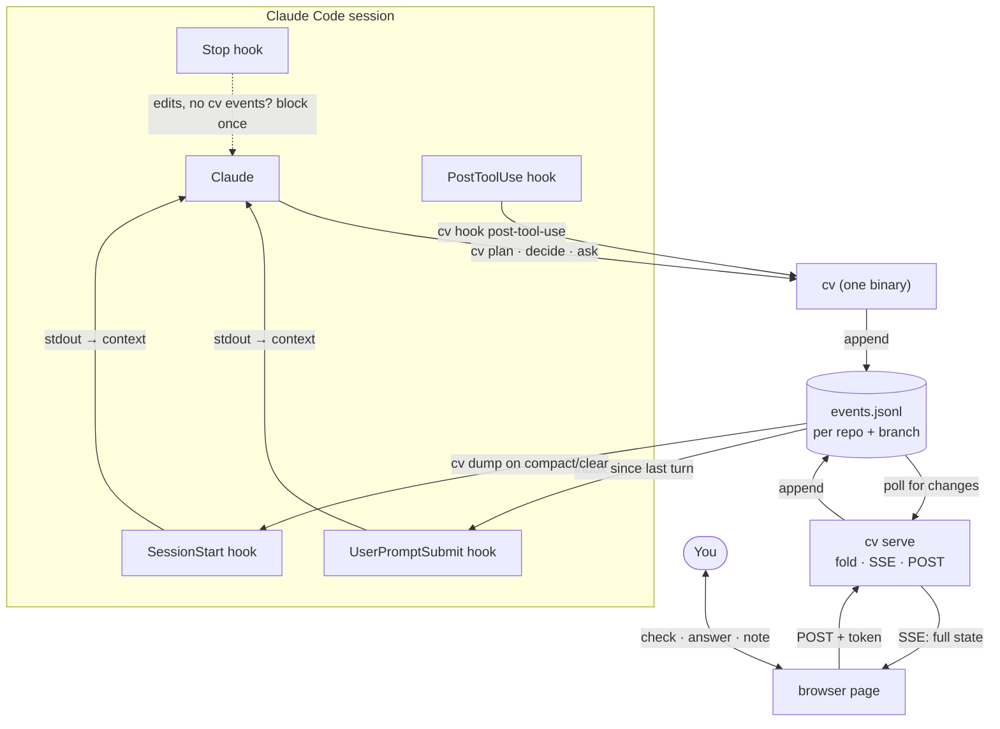

# Live Context UI — Plan

**Status:** planning, nothing built yet · **Updated:** 2026-10-02

Files in this folder:
- `plan.md` — this doc (the build spec)
- `proposal.html` — visual walkthrough of the design
- `mock.html` — standalone mock of the page; the visual target for phase 3

## Goal

A browser page next to the terminal that shows structured session state: plan, decisions, open questions, diagrams, facts and activity. You can answer and check things off in the page instead of the terminal. The same state gives Claude a compact summary to reload after compaction, so it doesn't have to reread the conversation.

## Decisions

| # | Decision | Why | Status |
|---|----------|-----|--------|
| D1 | Append-only JSONL event log is the source of truth | Claude never reads the file before writing; safe with several writers; history for free | decided |
| D2 | Go, one binary `cv` (CLI + hook handlers + server) | Already installed (go1.26.1), ~4ms warm start, stdlib covers HTTP/SSE/JSON/embed/tests | **proposed — confirm** |
| D3 | Fold events into state on the server; the page only renders | The fold logic lives once, in Go, and is tested once; no second copy in JS | proposed |
| D4 | One log per repo + branch | Survives `/clear` and new sessions | decided |
| D5 | Source in dotfiles, top-level `cv/` (not a stow package) | You said "probably dotfiles" | tentative |
| D6 | Tests with `go test` | You said yes | decided |

## Q1: Go vs bash + jq vs Bun

Startup measured on this machine (50-run average):

| | Startup | Can run the server? | Fold logic + tests | New install? |
|---|---|---|---|---|
| bash + jq | ~3–7ms | no (needs a second language) | jq `reduce`; awkward to test | no |
| **Go** | **~4ms** (first run after a build ~20ms while macOS scans it) | yes, stdlib `net/http` | plain Go + `go test` | no |
| Bun | ~10–20ms (typical) | yes | shared JS with the page | **yes, not installed** |
| Node | 67ms | yes | shared JS | no (nvm) |

Go isn't heavy at runtime; it's the fastest option here that can do everything. The cost is at dev time: a build step, more verbose JSON code, and a binary you build on each machine (never commit it). bash + jq is just as fast for appending, but the server and the fold would still need another language, so you'd end up maintaining two. Bun's main advantage, sharing the fold with the browser, goes away once the server does the folding (D3).

## Architecture



## Storage

- **Path:** `~/.local/state/cv/<repo-slug>/<branch>.jsonl`. Kept out of the repo so work repos don't need gitignore changes.
  - Repo comes from `git rev-parse --show-toplevel` on the hook's `cwd`.
  - Branch comes from `git branch --show-current`; a detached HEAD uses the short SHA.
  - `/` in branch names is escaped.
  - Outside a git repo, use a hash of the cwd.
- **Append:** `O_APPEND|O_CREATE|O_WRONLY` plus an exclusive `flock`, one `write` per line. The lock removes any doubt about large lines such as diagrams.
- **IDs:** the CLI folds the log to find the next id (`p4`, `d3`, `q2`) and prints it. Disk reads are cheap; what matters is that Claude never spends tokens reading the file.

### Event envelope

```json
{"ts":"2026-10-02T14:03:11Z","by":"claude","t":"plan","op":"set","id":"p3","status":"done"}
```

| Field | Values |
|---|---|
| `ts` | RFC 3339 UTC |
| `by` | `claude` · `hook` · `user` |
| `t` | component type (fixed set below) |
| `op` | operation for that type |
| `id` | stable per item |
| …rest | the operation's fields |

### Component types (fixed set)

| `t` | ops | written by | fields |
|---|---|---|---|
| `plan` | `add`, `set` | claude, user | `text`, `status`: todo/active/done/dropped |
| `decision` | `add`, `set` | claude | `text`, `why` |
| `question` | `add`, `answer` | claude / user | `text`, `choices[]?` / `text` |
| `diagram` | `put` | claude | `name`, `mermaid` |
| `fact` | `add`, `dismiss` | claude, user | `text` |
| `note` | `add` | user | `text`, `ref?` |
| `file` · `cmd` | `touch` · `run` | hook | `path`, `tool` · `cmd`, `exit?` |
| `turn` | `mark` | hook | `n` |

`table` is deferred to v2. Unknown `t`/`op` values stay in the log and are ignored by the fold, so new types won't break old binaries.

## CLI surface

```bash
cv plan add "Wire SSE endpoint"          # → p4
cv plan set p4 active|done|todo|dropped
cv decide "JSONL over JSON" --why "..."  # → d3
cv ask "CLI language?" --choice go --choice "bash + jq"   # → q2
cv diagram arch < arch.mmd               # or heredoc
cv fact "Hooks must exit 0 on any error"
cv dump                                  # compact state, for Claude
cv inbox                                 # your events since the last turn mark
cv serve [--port N]                      # one server, all logs
cv open                                  # open the page for this repo + branch
cv hook post-tool-use|user-prompt-submit|session-start|stop   # reads hook JSON on stdin
```

`cv dump` prints compact text rather than JSON, to keep it cheap in tokens:

```
PLAN 2/6  ✓p1 Pick event format · ✓p2 Sketch arch · ▶p3 Build cv · p4 Server · p5 Page · p6 Hooks
DECIDED   d1 JSONL over JSON (append-only) · d2 Scope repo+branch (survives /clear)
OPEN      q1 CLI language? [go | bash + jq | bun]
ANSWERED  q2 Where does it live? → dotfiles
FACTS     Hooks must exit 0 on any error
```

## Hooks

Every handler finishes in a few ms and **always exits 0 without writing anything if there's no log or something goes wrong**. A broken hook must never break a session.

| Hook | Matcher | Does |
|---|---|---|
| `PostToolUse` | `Edit\|Write\|MultiEdit\|NotebookEdit\|Bash` | Appends `file touch` / `cmd run` events |
| `UserPromptSubmit` | — | Prints `cv inbox` (your page edits since the last turn) to stdout, which goes into context, then appends a `turn mark` |
| `SessionStart` | `compact\|clear\|resume` | Prints `cv dump` so state comes back automatically after compaction |
| `Stop` | — | If there are file/cmd events since the last turn mark but no `by:claude` events, return `{"decision":"block","reason":"…log updates with cv"}`. Skip when `stop_hook_active` is true (prevents loops) |

The existing `SessionStart` herdr hook stays; the `cv` hook goes alongside it.

**Check during build:** whether the Bash `tool_response` in `PostToolUse` includes an exit code. If it doesn't, `cmd` events record no pass/fail and test detection waits.

## Server (`cv serve`)

- Binds to `127.0.0.1` only. One server handles every repo/branch log; the page URL picks one (`/?log=<slug>/<branch>`).
- Endpoints:
  - `GET /` serves the embedded page (`go:embed`)
  - `GET /state` returns the folded state as JSON
  - `GET /stream` is SSE and pushes the full state on each change (it's small)
  - `POST /events` accepts user events
- Change detection polls the log's size/mtime every 250ms. Stdlib only, no fsnotify dependency.
- **Security:** user events end up in Claude's context, so any other website you have open could otherwise POST to localhost and inject prompt text. To block that:
  - a random token generated per server, baked into the served page, and required on every POST
  - `Origin` must be the server's own origin
  - `Content-Type: application/json` only, with no CORS preflight handling
  - an allowlist of ops users may send: `question answer`, `plan set`, `note add`, `fact dismiss`
  - inbox output is framed as "user notes from the page"
- Lifecycle for v1: start it by hand in a herdr/tmux pane (`lsof` the port first). No auto-spawn, to avoid the respawn conflicts you've hit before.

## Page

- One HTML file with vanilla JS, no build step, Mermaid from the CDN. It's embedded in the binary.
- Renders the state from SSE and POSTs your actions. It doesn't fold or keep its own copy of the logic.
- `mock.html` is the visual target.

## Fold logic

`Fold(events) → State`: a pure function that applies events in file order.

| Case | Behavior |
|---|---|
| `add` with an existing id | treated as `set` (idempotent) |
| `set` / `answer` on an unknown id | ignored, counted in `State.Warnings` |
| malformed line | skipped, counted in `State.Warnings` |
| unknown `t` / `op` | ignored silently (forward compatibility) |

`Inbox(events)` returns `by:user` events after the last `turn mark`.

## Tests (`go test`)

Each function gets one expected case, one edge case and one failure case. Use `t.TempDir()` for real log files instead of mocks, and only add mock surface when a test actually needs it.

| Unit | Expected | Edge | Failure |
|---|---|---|---|
| `Fold` | add → set → done | set before add; duplicate add | malformed line skipped + warning |
| `Append` | line + newline written | quotes/newlines in text round-trip | unwritable dir → error |
| `LogPath` | repo + branch | `/` in branch; detached HEAD | not a git repo → cwd-hash fallback |
| `Inbox` | user events after the last turn | no turn mark yet | empty log |
| `Dump` | golden output | empty state | — |
| hook `post-tool-use` | Edit → `file touch` | unknown tool → no-op | bad stdin JSON → exit 0, nothing written |
| hook `stop` | edits without claude events → block | `stop_hook_active` → allow | no log → allow |
| `POST /events` | valid answer appended | disallowed op → 400 | bad/missing token → 403 |

## Phases (stop for review after each)

0. **Confirm** D2, D5, the name, and server lifecycle (open questions below).
1. **Core:** event types, `Append`, `LogPath`, `Fold`, `Dump`, `Inbox`, plus the `plan`/`decide`/`ask`/`fact`/`diagram`/`dump` commands, with tests.
2. **Hooks:** the four `cv hook` handlers with tests, wired into `claude/.claude/settings.json`.
3. **Server + page:** `cv serve`, embedded page built from `mock.html`, SSE, token-guarded POST, with tests.
4. **Adoption:**
   - a short skill or CLAUDE.md rule for when Claude logs
   - an entry in `decisions.md`
   - a build line in `install.txt` (`go build -o ~/.local/bin/cv ./cv`)

## Open questions

- **Q1/4** Go OK? (D2)
- **Q2/4** Top-level `cv/` in dotfiles, built to `~/.local/bin` (already on PATH)? Or its own repo in `~/things/myc/`?
- **Q3/4** Is the name `cv` OK? (It's free on PATH.)
- **Q4/4** Start the server by hand in a pane for v1, or have `cv open` start it?

## Out of scope for v1

- `table` component
- remote or multi-user access
- automatic distilling into `.mem/`
- editing plan text from the page (status only)
